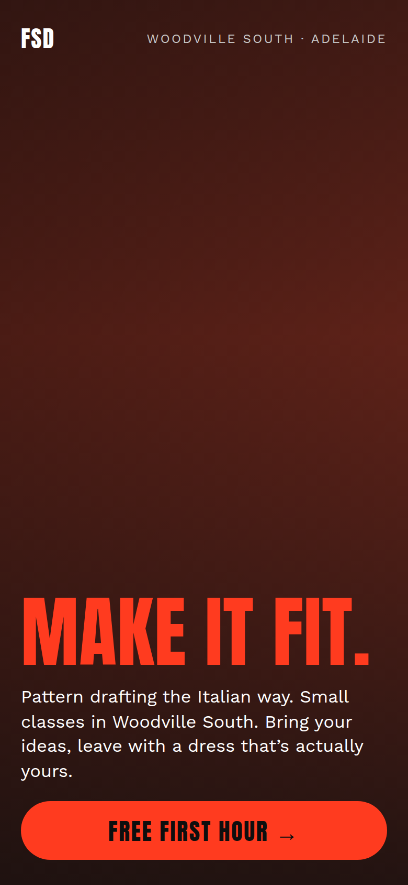
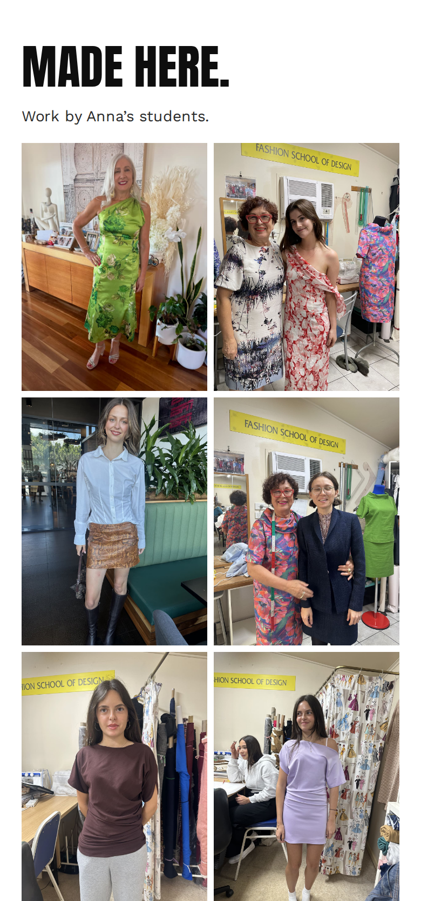
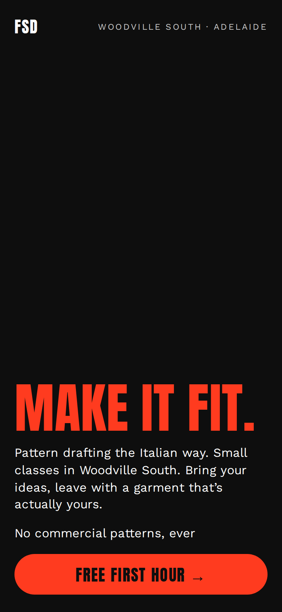
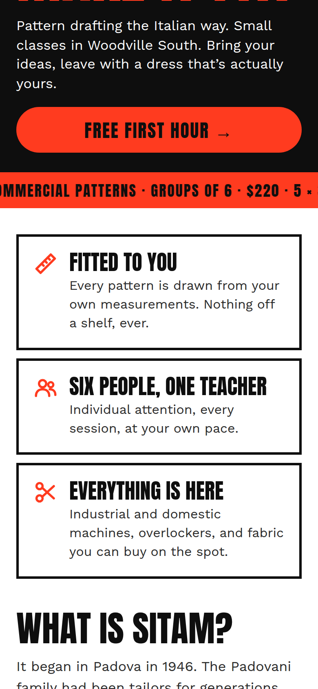
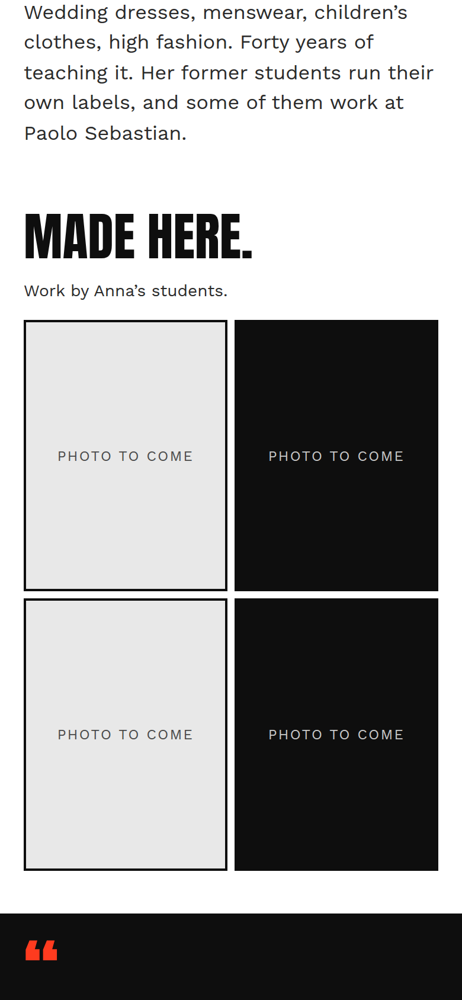
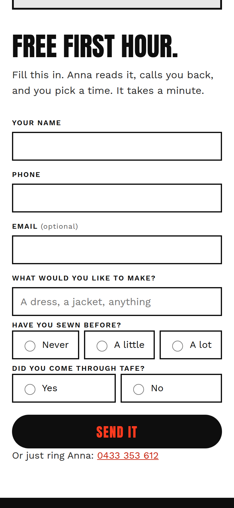
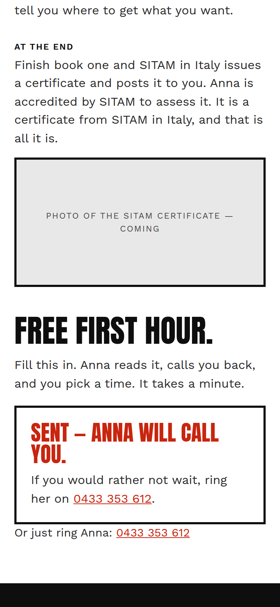

# The page at phone width

Every picture here is a real render of the page at 390 pixels wide, the width of a phone.

## With photographs in `photos/`

The first screen, with one of the photographs behind the headline:

"Made here" — the grid built from the folder:

## With `photos/` empty

This is how the page looks if the folder is empty. Plain black behind the headline, labelled slots in the grid. Nothing broken.

The ticker strip and the three boxes:

The photo grid with nothing in the folder:

## The enquiry form

And what someone sees after they send it:

